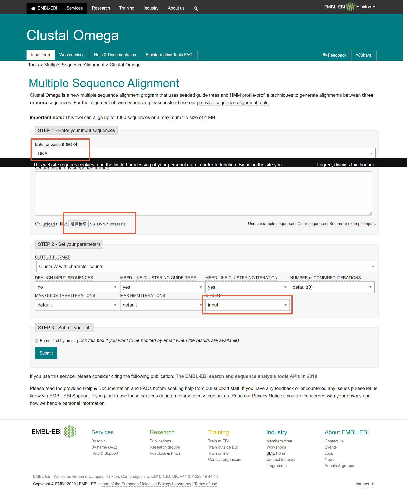
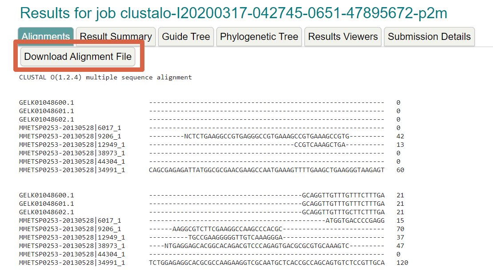

選出的序列放在`3.1序列分析`中的`NS_DVNP_cds.fasta`(cda序列)和`NS_DVNP_pep.fasta`(peptide序列)，利用這些序列就可以來做多重序列比對和演化分析

## 多重序列比對

使用[Clustal Omega](https://www.ebi.ac.uk/Tools/msa/clustalo/)工具做比對，以`cds`序列當範例，輸入模式選擇`DNA`，上傳檔案`NS_DVNP_cds.fasta`，參數設定中的`ORDER`改成`input`，整體設定如下，好了就可以submit

結果會像這樣，`download alignment file`右建另存新檔下來

### 畫圖

使用[espript工具](http://espript.ibcp.fr/ESPript/ESPript/)，上船剛剛的檔案，按submit即會出現結果，整體流程大概就是這樣，報告中所有的比對圖都是這樣產生的

